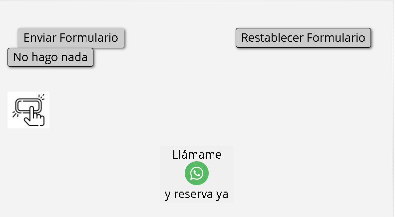

# Programación web en entorno cliente
## HTML
### Formulario
#### Botón Formulario
17. Botones
Para poder enviar o restablecer (borrar) los datos del formulario, necesitamos botones.

Los botones no llevan una etiqueta a la que asociarse porque ellos mismos ya tienen la etiqueta dentro del botón

Tenemos los siguientes 5 tipos de botones:

Ejecución del formulario:
Ejecuta el action del formulario.
Restablecimiento (reseteo) del formulario
Deja los campos de formulario tal y como estaban al entrar en la página (si hemos rellenado datos, los borraría)
Sin función
Este botón no hace nada, servirá para programar funciones personalizadas mediante Javascript
Botón de imagen
Convertimos una imagen en botón
Botón complejo
Permite insertar en el botón tanto texto como imagen

```html
		<input type="submit" value="submit - Enviar Formulario">
		
		<input type="reset" value="reset - Restablecer Formulario">

		<input type="button" value="button - No hago nada">

		<input type="image" src="../../images/iconos/favicon.ico" alt="image - cualquier tipo">
		
		<button>
			button
			
			imagen en button
		</button>
```


se puede usar button para todo pero es mas trabajo, mejor usar cada type
