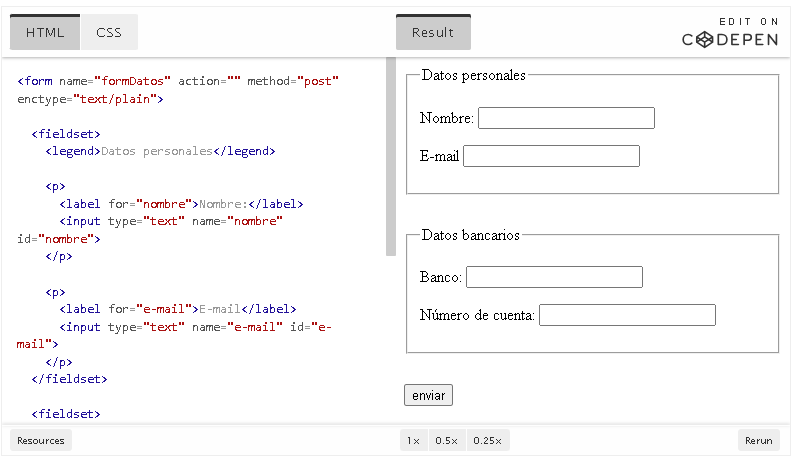
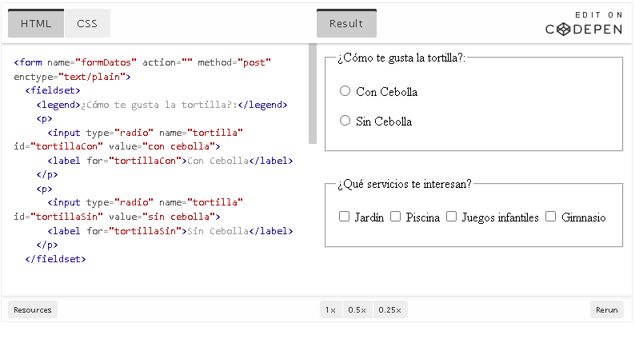

# Programación web en entorno cliente
## HTML
### Formulario
#### Elementos extra Formulario

##### Color
Permite elegir o insertar un color en formato hexadecimal.
```html
<input type="color" name="colorPpal" id="colorPpal">
```

---

##### Datalist
Campo de texto con sugerencias automáticas. El usuario puede escribir o elegir una opción. se usa `datalist`y dentro cada opción es `option`.
`list` es el `id` del datalist para unirlas 

```html
<input type="text" name="campoMusic" id="campoMusic" list="listaMusic">
<datalist id="listaMusic">
	<option value="Carlos Santana">
	<option value="Django Reinhardt">
	<option value="Eddie Van Halen">
	...
</datalist>
```
También se puede usar con otros tipos de input, como `time`:
```html
<input type="time" name="campoHora" id="campoHora" list="listaHoras">
<datalist id="listaHoras">
	<option value="10:00">
	<option value="15:00">
	<option value="18:00">
</datalist>
```
Se pueden mostrar etiquetas asociadas a los valores: se usa el atributo `label`
```html
<input type="text" name="campoTto" id="campoTto" list="listaTratamiento">
<datalist id="listaTratamiento">
	<option label="Sr" value="Señor">
	<option label="Sra" value="Señora">
	<option label="Srta" value="Señorita">
	<option label="Srto" value="Señorito">
</datalist>
```

---

##### Campo oculto (hidden)
Campo invisible para el usuario, útil para enviar datos adicionales, que esta relleno con `value` de antemano, puede ser texto, código de tiempo, ....
```html
<input type="hidden" name="key-campo" id="key-campo" value="valor-campo">
```

---

##### Output
Muestra el resultado de una operación calculada por JavaScript.
```html
<output></output>
```

---

##### Fieldset y Legend
###### En un formulario podemos tener datos de diferentes tipos (por ejemplo, datos personales y datos bancarios) y para diferenciarlos de una forma lógica podemos usar el elemento fieldset para agrupar cada tipo.

Para indicar el rótulo/título de cada tipo de datos utilizaremos el elemento legend:


###### Agrupa y categoriza campos relacionados en un formulario. `legend` añade un título al grupo.



###### diferenciar formularios
Si en la página tenemos más de un formulario (por ejemplo, formulario de contacto y formulario de búsqueda) podemos utilizar un elemento fieldset por cada formulario: no se suele usar es porque ya esta implícito en form


<fieldset>
	<legend>Formulario de búsqueda</legend>
	<form name="formBuscar">
		... campos del formulario ...
	</form>
</fieldset>


<fieldset>
	<legend>Formulario de contacto</legend>
	<form name="formContacto">
		... campos del formulario ...
	</form>
</fieldset>


---

##### Search
Sección dedicada a la búsqueda, similar a fieldset pero específica para formularios/resultados de búsqueda.
```html
<search>
	<form action="/buscar">
		<label for="query">Buscar artistas:</label>
		<input type="search" id="query" name="q" placeholder="Ej. Iron Maiden">
		<button type="submit">Buscar</button>
	</form>
</search>
```
Para mostrar resultados:
```html
<search>
	<h2>Resultados para tu búsqueda</h2>
	<ul>
		<li>AC/DC</li>
		<li>Iron Maiden</li>
		...
	</ul>
</search>
```